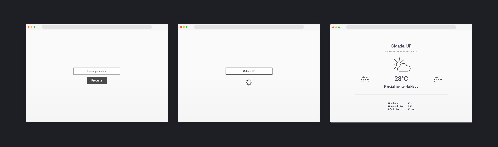

<h1 align="center">
  Teste Agência 2B
</h1>

  <a href="#-tecnologias">Tecnologias</a>&nbsp;&nbsp;&nbsp;|&nbsp;&nbsp;&nbsp;
  <a href="#-projeto">Projeto</a>&nbsp;&nbsp;&nbsp;|&nbsp;&nbsp;&nbsp;
  <a href="#-layout">Layout</a>&nbsp;&nbsp;&nbsp;|&nbsp;&nbsp;&nbsp;
  <a href="#memo-licença">Licença</a>&nbsp;&nbsp;&nbsp;|&nbsp;&nbsp;&nbsp;
  <a href="#memo-licença">Executar</a>

 
  

## 🚀 Tecnologias

Esse projeto foi desenvolvido com as seguintes tecnologias:

- React
  
- TypeScript
  
- Vite

- Tailwind
  
- Phosphor-react

- Axios

- Date-fns

## 💻 Projeto

### ✈️ O objetivo desse projeto foi fazer o seguinte teste : 

#### REGRAS GERAIS
- O projeto deve ser feito com algum framework web como Vue.js, React.
- Você pode usar quaisquer bibliotecas de terceiros.
- Crie um README com as instruções para compilar, testar e rodar o projeto.

- O link do repositório deverá ser enviado para o e-mail debora.teixeira@totvs.com.br e claydson.silva@totvs.com.br com o título **[teste front-end]**

#### Você deverá criar um SPA de previsão do tempo, onde requisitos são:
- Deve ser possível pesquisar a previsão do tempo para uma cidade.
- Exibir a previsão caso disponível.
- Tratar erro caso a previsão esteja indisponível, ou acontece algo inesperado.

Para conseguir realizar essa tarefa você deverá utilizar a popular api do OpenWeatherMap (http://openweathermap.org/). O mock das telas do que é desejavel que tenha no aplicativo, você pode dar um toque seu no design/layout, o importante é exibir ao menos a informação básica do que for retornado pelo OpenWeatherMap.

#### Seria desejável(não obrigatório)
- Utilizar algum padrão arquitetural
- Testes unitários

#### O que iremos analisar:
- Semântica Web.
- Seu conhecimento geral sobre Front e API Rest.
- Como você organiza/estrutura seu código.
- Uso do Git.
- Sua habilidade de lidar com uma API REST.
- Sua habilidade de entender uma documentação.
- Clean code.

-----

## 🔖 Layout

## 📝 Licença

Esse projeto está sob a licença MIT. Veja o arquivo [LICENSE](LICENSE.md) para mais detalhes.

##  📜 Como executar

#### No Front-end siga os seguintes passos :

- Instale as dependências com `yarn ou npm install`;

- Adicione um arquivo .env no projeto e passe sua chave gerada do [openweathermap](https://openweathermap.org/) para a variável , existe um arquivo de exemplo chamado `.env.example` com o nome da variável de ambiente que é usada pela Api.

- Inicie o servidor com `yarn dev ou npm run dev`;

A aplicação pode ser acessada em [`localhost:5174`](http://localhost:5174/) no front-end.

obs: Para que o projeto funcionar corretamente no localhost deve-se se fazer o cadastro no site da https://openweathermap.org/ para gerar um Api-key, no caso existe uma api grátis , porém há limites de requisição faça a consulta na documentação antes de aplicar no projeto.

-------